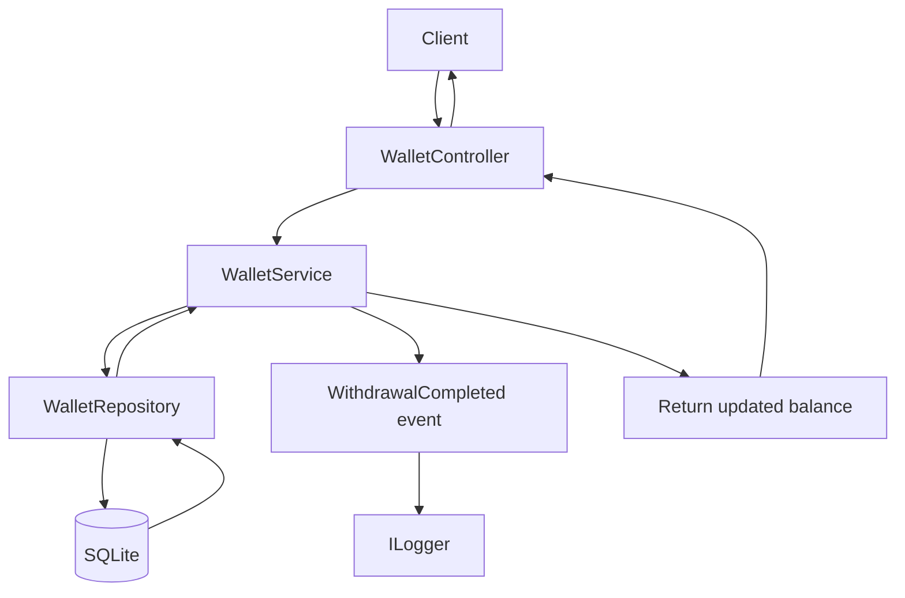
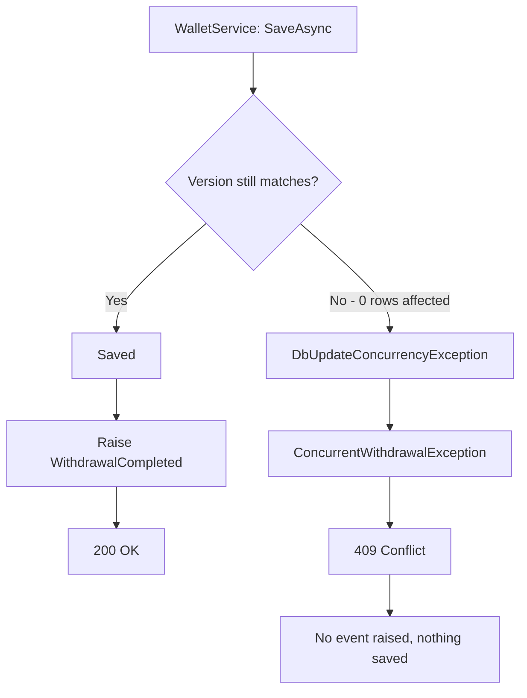

# Wallet API

A small ASP.NET Core Web API for viewing a wallet balance and withdrawing money from it.

It's deliberately kept small: the business rules live in one class, there's one service, one repository, and one controller. The goal was something I can read top-to-bottom and explain without hand-waving.

## What it does

Two things:

1. Show a wallet's current balance.
2. Withdraw an amount from the wallet.

A withdrawal only succeeds if the amount is positive and there are enough funds. When it succeeds, the balance is updated, saved, and a withdrawal event is raised internally. The balance can never go negative.

## Tech stack

| What | Why |
|---|---|
| .NET 8 / ASP.NET Core Web API | Target framework |
| Entity Framework Core 8 | Data access |
| SQLite | Zero-setup local database — it's just a file |
| xUnit | Tests |
| Native C# events | In-process notification, no message broker needed |
| `ILogger` | Operational logging only |
| Swagger / Swashbuckle | Manual testing in the browser |

No MediatR, no RabbitMQ, no Docker, no CQRS. Nothing here needed them.

## Project structure

```
WalletApplication.API/
├── Controllers/
│   └── WalletController.cs        HTTP endpoints, maps exceptions to status codes
├── Dtos/
│   └── WalletDtos.cs              WithdrawRequest, BalanceResponse
├── Models/
│   ├── Wallet.cs                  The entity + all withdrawal business rules
│   └── WalletExceptions.cs        Domain exceptions
├── Repositories/
│   ├── IWalletRepository.cs
│   └── WalletRepository.cs        EF Core implementation
├── Services/
│   ├── IWalletService.cs
│   └── WalletService.cs           Orchestrates the flow, owns the event
├── Data/
│   └── WalletDbContext.cs         EF mapping, concurrency config, seed data
├── Events/
│   └── WithdrawalEvent.cs         Event payload
├── Program.cs                     DI registration, DB creation, pipeline
└── tests/
    └── WalletApplication.Tests/   17 xUnit tests
```

The test project sits under `tests/` inside the API project folder. Because of that, the API `.csproj` has a `DefaultItemExcludes` line to stop it compiling the test files — without it you get a pile of "type `Fact` not found" and duplicate-assembly-attribute errors.

## Running it locally

```sh
dotnet restore
dotnet build
dotnet run
```

Then open the Swagger UI at <http://localhost:5033/swagger>.

`dotnet run` uses the first profile in `Properties/launchSettings.json` (`http`), which serves on <http://localhost:5033> and opens Swagger in your browser automatically. To use HTTPS instead:

```sh
dotnet run --launch-profile https
```

That serves on `https://localhost:7292` and `http://localhost:5033`.

Swagger is only enabled in the Development environment, which is what both profiles set.

## Angular frontend

There's a separate Angular frontend that calls this API. It runs on `http://localhost:4200`.

Start the API first, then the Angular dev server. The API has to be running or the frontend has nothing to call.

Because the frontend (`localhost:4200`) and the API (`localhost:5033`) are different origins, the browser blocks the requests unless the API opts in via CORS. That's configured in `Program.cs` as a named policy:

```csharp
builder.Services.AddCors(options =>
{
    options.AddPolicy("Angular", policy =>
    {
        policy.WithOrigins("http://localhost:4200")
              .AllowAnyHeader()
              .AllowAnyMethod();
    });
});
```

Two ordering rules matter here, and both caused real problems while building this:

1. **`AddCors` must come before `builder.Build()`.** The DI container is sealed once `Build()` is called, so registering anything afterwards throws `InvalidOperationException: The service collection cannot be modified because it is read-only`.
2. **`app.UseCors("Angular")` must come before `app.UseAuthorization()` and `app.MapControllers()`.** The browser sends a preflight `OPTIONS` request before the real call. If CORS runs too late, that preflight is handled without the `Access-Control-Allow-Origin` header and the browser blocks the request — even though the policy itself is correct.

If the Angular dev server starts on a different port (4201, say, because 4200 was taken), update `WithOrigins(...)` to match or the requests will be blocked.

### HTTPS redirection

`app.UseHttpsRedirection()` is in the pipeline. If the frontend calls `http://localhost:5033`, it gets a `307` redirect to the HTTPS port, and cross-origin redirects tend to surface as confusing CORS errors. Either point the frontend at `https://localhost:7292` and run the API with `--launch-profile https`, or comment out `UseHttpsRedirection()` for local development.

## The database

SQLite, created automatically. On startup `Program.cs` does:

```csharp
dbContext.Database.EnsureCreated();
```

If `wallet.db` doesn't exist, EF creates it with the schema and the seed row. If it already exists, EF leaves it completely alone.

That last part matters: **`EnsureCreated()` never alters an existing database.** There are no migrations in this project. So if the model changes, the old `wallet.db` has to be deleted or the app will break on the missing column.

The connection string falls back to `Data Source=wallet.db` if there's no `WalletDatabase` entry in `appsettings.json`, so the file lands in the project root.

### Seeded wallet

```
Id:      11111111-1111-1111-1111-111111111111
Balance: 1000.00
Version: 0
```

## Endpoints

### Get balance

```
GET /api/wallets/{walletId}/balance
```

```sh
curl https://localhost:7292/api/wallets/11111111-1111-1111-1111-111111111111/balance
```

```json
{
  "walletId": "11111111-1111-1111-1111-111111111111",
  "balance": 1000.00
}
```

### Withdraw

```
POST /api/wallets/{walletId}/withdraw
```

```sh
curl -X POST https://localhost:7292/api/wallets/11111111-1111-1111-1111-111111111111/withdraw \
  -H "Content-Type: application/json" \
  -d '{ "amount": 250.00 }'
```

```json
{
  "walletId": "11111111-1111-1111-1111-111111111111",
  "balance": 750.00
}
```

Both endpoints return the same `BalanceResponse` shape, which keeps the client simple.

## Withdrawal business rules

All of these live in `Wallet.Withdraw(amount)` — not in the service, not in the controller:

- Amount must be greater than zero (rejects both `0` and negatives)
- Amount must not exceed the current balance
- Balance can never go negative

`Balance` has a `private set`, so the only way to change it is through `Withdraw`. That's what actually guarantees the "never negative" rule — it isn't enforced by validation somewhere else that could be bypassed.

## Error responses

| Situation | Status | Body |
|---|---|---|
| Success | `200 OK` | `{ "walletId": "...", "balance": 750.00 }` |
| Zero / negative amount | `400 Bad Request` | `{ "error": "Withdrawal amount must be greater than zero." }` |
| Not enough funds | `400 Bad Request` | `{ "error": "Insufficient funds for this withdrawal." }` |
| Wallet doesn't exist | `404 Not Found` | `{ "error": "Wallet '...' was not found." }` |
| Concurrent withdrawal | `409 Conflict` | `{ "error": "Wallet '...' was modified by another withdrawal. Please retry." }` |

There's no exception-handling middleware. The controller catches the domain exceptions and maps each to an appropriate HTTP status code. With one controller, that's easier to follow than a global handler.

A `409` means the request was rejected and nothing was saved — retrying it is safe.

## The withdrawal event

`WalletService` exposes a plain C# event:

```csharp
public event EventHandler<WithdrawalEvent>? WithdrawalCompleted;
```

The payload carries `WalletId`, `Amount`, and `OccurredAtUtc`.

`WalletController` subscribes in its constructor and logs the event when it fires.

Two things worth being clear about:

- **The event is the notification mechanism.** If something else ever needs to react to a withdrawal, it subscribes.
- **`ILogger` is only operational logging.** It's for diagnostics, not for telling other parts of the system that something happened.

The event is raised *after* the save succeeds. It never fires for a failed withdrawal — not for a validation failure, and not for a concurrency conflict — because in both of those cases an exception is thrown before the invoke line is reached.

## Optimistic concurrency

`Wallet` has an `int Version` property, configured as an EF Core concurrency token:

```csharp
wallet.Property(w => w.Version).IsConcurrencyToken();
```

`Withdraw()` increments it on every successful withdrawal.

Because it's a concurrency token, EF puts the *original* version into the `WHERE` clause of the update:

```sql
UPDATE "Wallets" SET "Balance" = @p0, "Version" = @p1
WHERE "Id" = @p2 AND "Version" = @p3;   -- @p3 is the version we read
```

If another request already saved, the stored version has moved on, the `WHERE` matches zero rows, and EF throws `DbUpdateConcurrencyException`. The service catches it and rethrows a `ConcurrentWithdrawalException`, which the controller turns into a `409`.

### Why this was needed

Without it, two simultaneous withdrawals of 600 from a balance of 1000 would both read 1000, both compute 400, and both save — 1200 withdrawn from a 1000 wallet, and both requests returning `200 OK`. The entity's rules aren't enough on their own, because the read and the write aren't atomic across requests.

## Flow diagrams

Successful withdrawal:



Concurrency conflict:



## Design decisions

**Business rules in the entity, not the service.** `Wallet` owns its invariants. The service can't accidentally create a negative balance because there's no setter to misuse.

**A single non-generic repository.** Two methods, exactly what's needed. A generic `IRepository<T>` would add indirection without helping anything here.

**Exceptions for business rule failures.** They travel cleanly from the entity up to the controller, and the controller maps them to status codes in one place.

**Native C# event instead of a message broker.** The event is in-process and the frontend doesn't need it. A broker would be a lot of infrastructure for one log line.

**`EnsureCreated()` instead of migrations.** The schema is one table and there's no production database to preserve. `dotnet run` and it works.

**`Version` as a dedicated token rather than using `Balance`.** Using `Balance` itself would have worked and needed no schema change, but it breaks down if deposits are ever added — two operations could return the balance to the same value and the conflict would go undetected. A dedicated counter always changes.

## Assumptions

- Single wallet per request, identified by ID in the URL. No users, no auth, no ownership checks.
- Withdrawals only. No deposits, no transfers, no transaction history.
- One currency, so no currency field on the wallet.
- Single application instance against a local SQLite file.
- The Angular frontend runs on `http://localhost:4200` in development.
- A client receiving a `409` will decide whether to retry; the API doesn't retry for it.

## Trade-offs

- **`EnsureCreated()` over migrations** — simpler to run, but the database has to be deleted by hand whenever the model changes.
- **Try/catch in the controller over middleware** — obvious with one controller, would need revisiting with several.
- **Optimistic over pessimistic locking** — no locks held, but a losing request has to be retried.
- **Event subscribed in the controller constructor** — simple and leak-free since both are scoped, but it means the logging only happens for withdrawals that come through this controller.
- **Deterministic concurrency tests over real threads** — reliable and not flaky, but they don't exercise genuine parallel execution.

## Known limitations

- No authentication or authorisation at all.
- No deposits or transaction history, so there's no audit trail of withdrawals.
- The withdrawal event is in-memory only. If the process dies right after a save, the event is gone — the money moved but nothing was notified.
- The event handler runs synchronously inside the request, so a slow subscriber would slow the response.
- SQLite is a single file and doesn't handle high write concurrency well.
- No rate limiting, pagination, or health checks.
- CORS is open to `http://localhost:4200` only. Fine for local development, but any other environment needs the origin changed.
- `[Required]` on `WithdrawRequest.Amount` doesn't do anything, since `decimal` is a non-nullable value type. A body of `{}` binds `Amount` to `0` and is then correctly rejected by the domain rules as `400` — so the behaviour is right, but the error message says "must be greater than zero" rather than "amount is required".

## Future improvements

- EF Core migrations instead of `EnsureCreated()`.
- Deposits and a transaction/ledger table, which would give a real audit trail.
- Move the event subscription out of the controller so it fires regardless of the caller.
- Global exception-handling middleware once there's more than one controller.
- Authentication, and checking that the caller owns the wallet.
- Integration tests over the HTTP layer with `WebApplicationFactory`.
- A real database if this ever ran as more than one instance.

## Tests

```sh
dotnet test
```

17 tests, split across three files:

- `WalletTests.cs` — the entity's business rules in isolation.
- `WalletServiceTests.cs` — the service flow against real in-memory SQLite, so the repository and EF mapping get exercised too.
- `WalletConcurrencyTests.cs` — two `DbContext` instances sharing one connection, simulating two requests reading the same balance.

They cover successful withdrawal, insufficient funds, zero and negative amounts, balance unchanged after failure, event raised on success, event not raised on failure, wallet not found, and the concurrency conflict path.

The concurrency tests were checked by temporarily removing `.IsConcurrencyToken()` and confirming they fail — otherwise it's hard to tell whether they'd catch a real regression.

## Resetting the database

Delete the file and restart:

```sh
rm wallet.db
dotnet run
```

You'll get a fresh database with the seeded wallet back at 1000.00. Do this whenever the `Wallet` model changes, since `EnsureCreated()` won't update an existing schema.

## AI usage

I used GitHub Copilot throughout this project, mostly as a faster way to write code I already knew I wanted:

- Scaffolding the initial classes — entity, DTOs, repository, service, controller — from a structure I'd decided on.
- Diagnosing a build failure where the API project was compiling the test project's files. The fix was the `DefaultItemExcludes` line in the `.csproj`.
- Adding the optimistic concurrency work: the `Version` token, the exception translation, the `409`, and the concurrency tests.
- Writing this README.

I reviewed everything that went in. A couple of things worth noting about the process: one AI edit clipped the `Withdraw` method's parameter list and broke the build, which the compiler caught immediately. And the concurrency tests were only trusted after deliberately breaking the implementation to confirm they'd fail — passing tests on their own don't prove much.

The design decisions — rules in the entity, a dedicated `Version` token over reusing `Balance`, no extra infrastructure — were mine, and I can explain the reasoning behind each.

## Angular client

A small Angular 16 client is included to demonstrate the API interaction.

The client:

Loads the seeded wallet balance when the page opens.
Allows the user to enter a withdrawal amount.
Sends the withdrawal request to the API.
Displays the updated balance after a successful withdrawal.
Displays validation and API errors when a withdrawal fails.

The client is intentionally minimal because the assessment focuses primarily on the backend.

Run the Angular client

From the repository root:

cd wallet-client
npm install
ng serve

Then open:

http://localhost:4200

The Angular client expects the Wallet API to be running locally. Start the API first using the backend instructions above.

Application flow
Angular Client
      |
      v
WalletController
      |
      v
WalletService
      |
      v
WalletRepository
      |
      v
SQLite Database

The Angular client is responsible only for displaying the wallet balance and submitting withdrawal requests. The backend remains responsible for validation, withdrawal business rules, persistence, concurrency handling, and emitting the withdrawal event.


